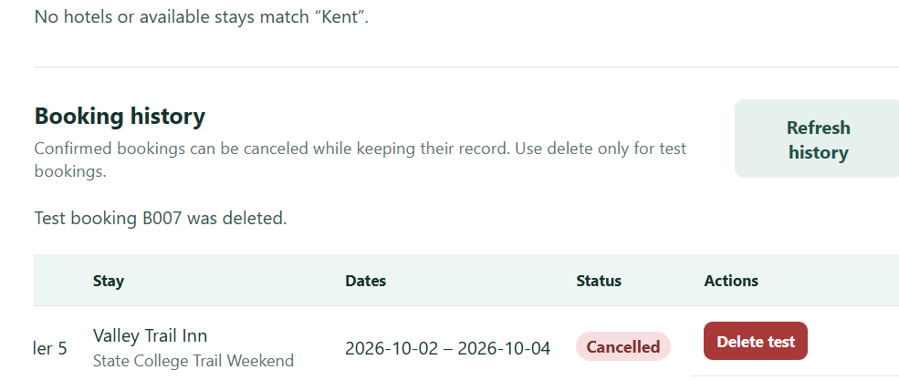

# Reservation Lite — Part 2

## Repository and commit

Repository: https://github.com/emadzam/reservation

Part 2 application commit: 2b3f40087f53dbe8e1f4d965f7beb81aff116d20 — Complete Part 2 SQLite booking workflow. Final reviewed merge into main: f7a5b81906dcc90ac7c257b84dc05f4d028136c2.

## Implementation

Reservation Lite uses a SQLite database initialized using the provided `hotels.csv`, `trips.csv`, `users.csv`, and `bookings.csv` files. The backend uses MVC: entity classes and request contracts are in `backend/models/`; `DatabaseController` managing connections, reference validation on seed, foreign keys, and persistence; `SearchController` and `BookingController` manage search and booking operations; FastAPI endpoints adapt those controllers to HTTP.

The Vue frontend is the View layer. It allows searching for hotels, choosing a demo traveler, creating a simulated booking, listing booking history, changing a booking to `cancelled` while retaining it, and deleting a test booking. The API contract is described in `docs/api-contract.md`.

## Verification

- Search for Harbor returned two Harbor Lantern Hotel stays.
- Creating a booking for Demo Traveler 1 produced unique booking B007 in history.
- Cancelling B007 retained it in history with status Cancelled.
- Deleting the temporary B007 removed the test record.
- After a browser refresh and restarting both local services, B007 remained Cancelled.
- backend/test_api.py passed search, create, cancel, delete, restart-safe seeding, and invalid-reference checks.

### Screenshots

## Demo video

[demo](docs/part2-demo.mp4)

## Project context

The [README](README.md) has local run instructions and MVC layout. Project rules are in [AGENTS.md](AGENTS.md), architecture decisions are in [docs/design-note.md](docs/design-note.md), API contracts are in [docs/api-contract.md](docs/api-contract.md), the selected prompt is in [prompts/part2-mvc-scope.md](prompts/part2-mvc-scope.md), and the current handoff is [handoffs/current.md](handoffs/current.md).

