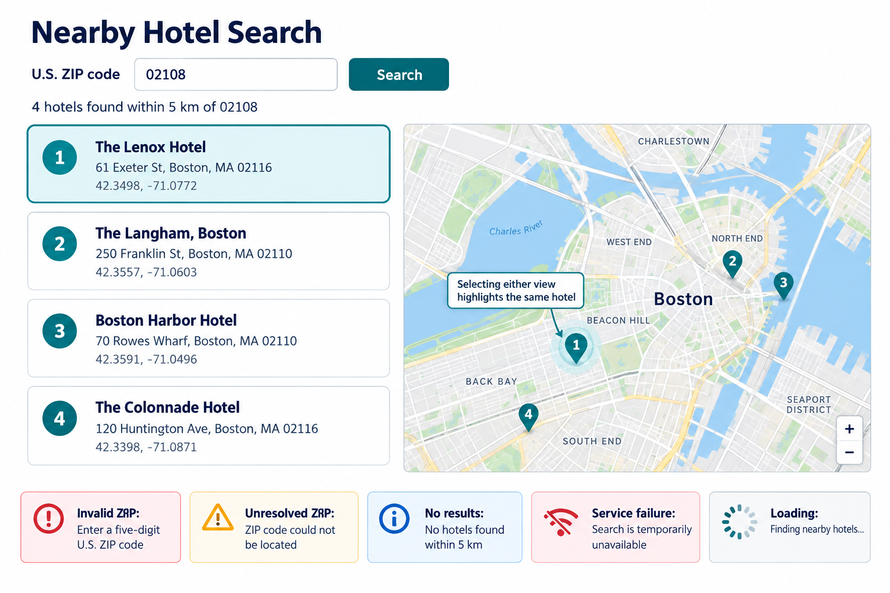

# Assignment 2 — Part 1: Live Hotel Search and Map


## Project access

- Repository: [github.com/emadzam/reservation](https://github.com/emadzam/reservation)
- Current assessed base commit: `ee70bbf` (replace this with the final Assignment
  2 Part 1 commit hash after committing the reviewed work).
- Startup and configuration instructions: [README.md](README.md)
- API contract: [docs/api-contract.md](docs/api-contract.md)

To run locally, create a local `.env` file from `.env.example`, add the
Geoapify key, start FastAPI with `python -m uvicorn backend.main:app --reload`,
and serve `frontend/` on port 5173. The `.env` file is ignored by Git and the
key is never copied into the frontend.

## Research notes

Research sources, useful features, limitations, and design decisions are in
[docs/assignment2-part1-research.md](docs/assignment2-part1-research.md).

The main decisions were to use Geoapify Geocoding for exact U.S. ZIP resolution,
Geoapify Places with an `accommodation.hotel` 5 km circle filter, and Leaflet
for an interactive synchronized list and map. A static map was not used because
it cannot support the required marker/list selection behavior. Provider fields
can be incomplete, so the app labels missing names and addresses honestly rather
than inventing data.

## Early mockup

The early mockup was prepared before the live-map implementation. It shows the
ZIP form, list/map interaction, and loading, invalid ZIP, unresolved ZIP,
no results, and service-failure states.



The implementation keeps the mockup’s two-column layout and shared selection
behavior. It was adjusted to use live Geoapify data, OpenStreetMap tiles, and
honest fallback labels for missing provider fields.

## Implementation

The Vue frontend is the View layer. It validates the five-digit ZIP input,
displays clear interface states, renders API-returned hotel names, locations,
and coordinates, and uses Leaflet for an interactive map. Selecting a hotel
card updates its map marker; selecting a marker selects the same list item.

FastAPI resolves the exact requested U.S. ZIP before calling Geoapify Places.
The Places query uses an `accommodation.hotel` category and a 5,000-metre circle
centered on the returned ZIP location. An unresolved ZIP never falls back to a
different location. The client does not access CSV files, SQLite, or secret
keys.

## Screen-recorded demo video

[Watch the Assignment 2 Part 1 demo video](docs/assignment2-part1-demo.mp4)

The recording shows the running local application, including live ZIP search,
hotel-list results, and the interactive Leaflet map. It is stored in `docs/` so
the report link continues to work with the submitted project files.

## Verification record

| Date | Input or action | Expected result | Observed result | Correction or limitation |
| --- | --- | --- | --- | --- |
| 2026-09-29 | Run the automated test command below | Controllers validate ZIPs, preserve exact matching, request Places inside 5 km, and handle provider failures | 11 checks passed | Tests use mocked provider responses and do not spend live API credits. |
| 2026-09-29 | Search live ZIP `16801` | Nearby hotels load as a list and interactive map | 15 live hotels appeared; markers, zoom controls, and the 5 km circle were visible | Results can change as Geoapify’s live data changes. |
| 2026-09-29 | Enter invalid ZIP input | Clear invalid-input feedback without a provider request | The page displayed the five-digit ZIP instruction | None. |
| 2026-09-29 | Initial map check | Leaflet map should render with live results | The hotel list loaded but the map panel was blank | Corrected Leaflet CDN tags in `frontend/index.html`, refreshed, and confirmed the interactive map appeared. |

Automated command:

```text
.venv\Scripts\python.exe -m unittest backend.test_api backend.test_location backend.test_nearby_hotels -v
```

## AI disclosure and evidence log

The complete concise disclosure, tool/model list, selected prompt excerpts,
linked code evidence, and failed/revised map approach are in
[prompts/assignment2-part1-ai-log.md](prompts/assignment2-part1-ai-log.md).

## Remaining limitations

The app depends on live Geoapify and OpenStreetMap availability. No price,
rating, availability, booking, user account, payment, or deployment feature is
included because those are outside Assignment 2 Part 1.
